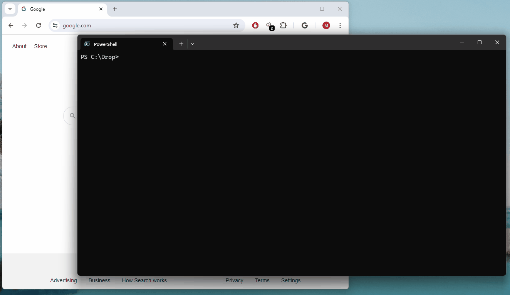

# kubedashproxy

A simple way to open kubernetes dashboard in a browser without having to 
port-forward, create a token, or create a long-lived secret.



## Installation

Ensure kubernetes dashboard is installed in your cluster (in the `kubernetes-dashboard` namespace by convention).
```bash
helm repo add kubernetes-dashboard https://kubernetes.github.io/dashboard/
helm upgrade --install kubernetes-dashboard kubernetes-dashboard/kubernetes-dashboard --create-namespace --namespace kubernetes-dashboard
```

Ensure you have a service account to access the dashboard (`kubernetes-dashboard` by convention).
```bash
kubectl create serviceaccount kubernetes-dashboard -n kubernetes-dashboard
kubectl create clusterrolebinding kubernetes-dashboard-cluster-admin --clusterrole=cluster-admin --user=kubernetes-dashboard
```

Add the `kubedashproxy` binary to your path.  You can download the latest release from the 
[releases page](https://github.com/mgaffigan/kubedashproxy/releases).

## Usage

Run `kubedashproxy` in a terminal. It will open the kubernetes dashboard in your default browser.

```bash
PS C:\drop> kubedashproxy
info: Program[0]
      Listening on http://localhost:34980
info: PortForwardService[0]
      kubectl port-forward: Forwarding from 127.0.0.1:34943 -> 8443
info: PortForwardService[0]
      kubectl port-forward: Forwarding from [::1]:34943 -> 8443
info: TokenProvider[0]
      Acquiring new token
info: PortForwardService[0]
      kubectl port-forward: Handling connection for 34943
```

If kubernetes dashboard is not installed in the `kubernetes-dashboard` namespace, you can specify 
the namespace with the `--namespace` argument or the `KUBEDASH_NAMESPACE` environment variable.
Run `kubedashproxy --help` for other options.

## Releasing a build

```bash
dotnet publish -c Release -r win-x64 -p:PublishSingleFile=true -p:SelfContained=false
dotnet publish -c Release -r win-x64 -p:PublishAot=true
```